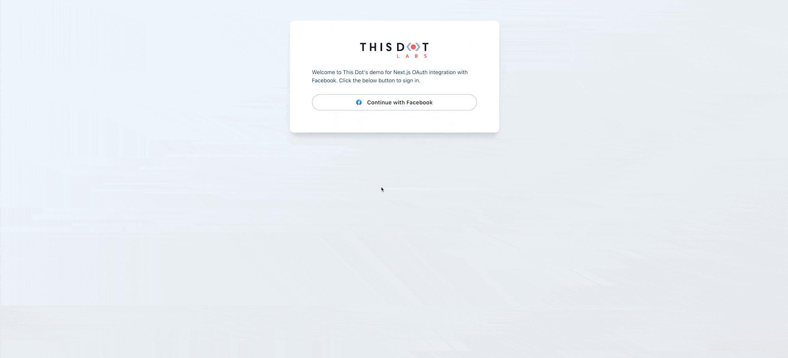

# Next.js OAuth Integration With Facebook Using Auth.js / NextAuth.js

This is a [Next.js](https://nextjs.org/) project bootstrapped with [`create-next-app`](https://github.com/vercel/next.js/tree/canary/packages/create-next-app).

This is a small demo showing how to integrate a Next.js with Facebook using the following features/libraries:

- Next.js 13's latest features such as the `/app` directory and server components
- Auth.js (formerly NextAuth.js)
- Tailwind for styling (thanks to [Flowbite](https://flowbite.com/) for the design)

## Getting Started

Install:

```bash
npm install
```

Copy `.env.example` to `.env.local` and adjust values.

Then, run the development server:

```bash
npm run dev
```

Open [http://localhost:3000](http://localhost:3000) with your browser to see the result.

You can start editing the page by modifying `app/page.tsx`. The page auto-updates as you edit the file.

## Demo

